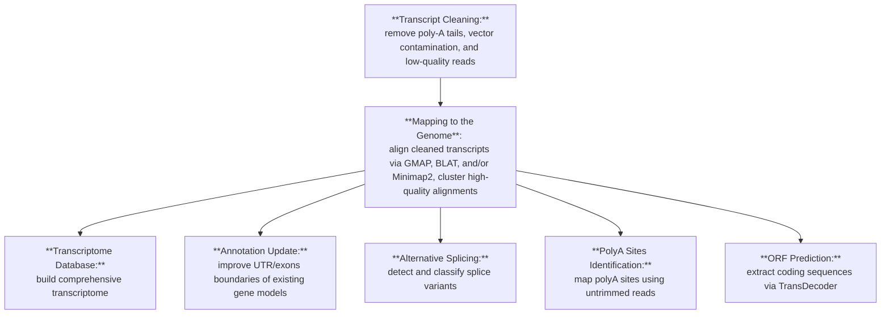

# PASApipeline
## Introduction

PASA (Program to Assemble Spliced Alignments) is a robust eukaryotic genome annotation tool. It accepts various transcript sources (EST, cDNA, RNA-Seq) assembled either *de novo* or using a genome-guided approach. PASA can generate novel annotations or refine existing ones by clustering high-confidence spliced transcript alignments, and supports alternative splicing and polyadenylation site analyses.

> **Note**: PASA was developed in the early 2000s, and its [original documentation](https://github.com/PASApipeline/PASApipeline/wiki) has accumulated patchy updates over time, sometimes mixing general usage with sample data examples. This fork aims to make the documentation clearer and easier to follow.

## Pipeline Overview

### Input

**Possible transcripts sequencing technologies:**

| Source                     | Time period      | Pros                                                   | Cons                                                                                           |
| -------------------------- | ---------------- | ------------------------------------------------------ | ---------------------------------------------------------------------------------------------- |
| EST libraries              | Late 1990s–2000s | High-throughput sampling at low cost                   | Fragmentary reads (≈200–800 nt) requiring intensive assembly                                   |
| Full-length cDNA libraries | Early–mid 2000s  | Complete transcript boundaries, accurate UTR mapping   | Low throughput, higher cloning/sequencing cost                                                 |
| RNA-Seq                    | 2010s–present    | Deep coverage, cost-effective, dynamic discovery       | Short fragments result in assembly errors, isoform collapse, missing low-abundance transcripts |
| long-read RNA-seq          | 2015–present     | End-to-end transcript reads, robust isoform resolution | Higher per-base error rates, lower throughput, greater expense                                 |

**Possible transcriptome assembly strategies:**

|                    |                                                                                                                                                                                                  |                                                 |                                                             |
| ------------------ | ------------------------------------------------------------------------------------------------------------------------------------------------------------------------------------------------ | ----------------------------------------------- | ----------------------------------------------------------- |
| **Strategy**       | **Description**                                                                                                                                                                                  | **Pros**                                        | **Cons**                                                    |
| _de novo_          | Assemblies generated solely from RNA-Seq reads without genome reference guidance (e.g. Trinity, RNA-Bloom)                                                                                       | Captures novel and sample-specific transcripts  | Potential misassemblies, chimeric contigs, isoform collapse |
| genome-guided (GG) | Genome is used to align RNA-seq reads before assembling them into transcripts (e.g., Cufflinks, StringTie), or as a guide to cluster _de novo_ transcripts (e.g., Trinity in genome-guided mode) | Accurate exon–intron boundaries; fewer chimeras | Dependent on reference quality; may miss novel loci         |
